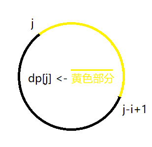

#### 未来试题 题解

**Tags** : 计数 / 概率DP / 发现性质

考虑 DP，设 $f_{i,j}$ 表示长度为 $i$ 的随机排列，逆序对数在对 $k$ 取模的意义下为 $j$ 的概率。

则有：
$$
f_{i,j}=\frac{1}{i}\sum_{x=0}^{i-1}f_{i-1,j-x \bmod k}
$$

$$
f_{1,0}=1
$$

可以用前缀和优化到 $O(nk)$。

观察 DP 式，发现每次关于 $f_{i,x}$ 的转移是关于 $f_{i-1,x}$ 在模 $k$ 意义下的环上连续 $i$ 个数的平均数。

考虑 $i=k$ 的时候，这连续 $k$ 个数恰好为 $f_{k-1,0},f_{k-1,1},\cdots,f_{k-1,k-1}$ 整个环。

所以 $f_{k,0}=f_{k,1}=\cdots=f_{k,k-1}=\frac{1}{k}$。

再根据 DP 式可以归纳出，当 $x\ge k,y\in[0,k-1]$ 时均有 $f_{x,y}=\frac{1}{k}$。

所以，DP 递推最多只需进行 $k$ 次，当 $n\ge k$ 时，答案恒为 $\frac{1}{k}$。

总时间复杂度 $O(k^2)$。
