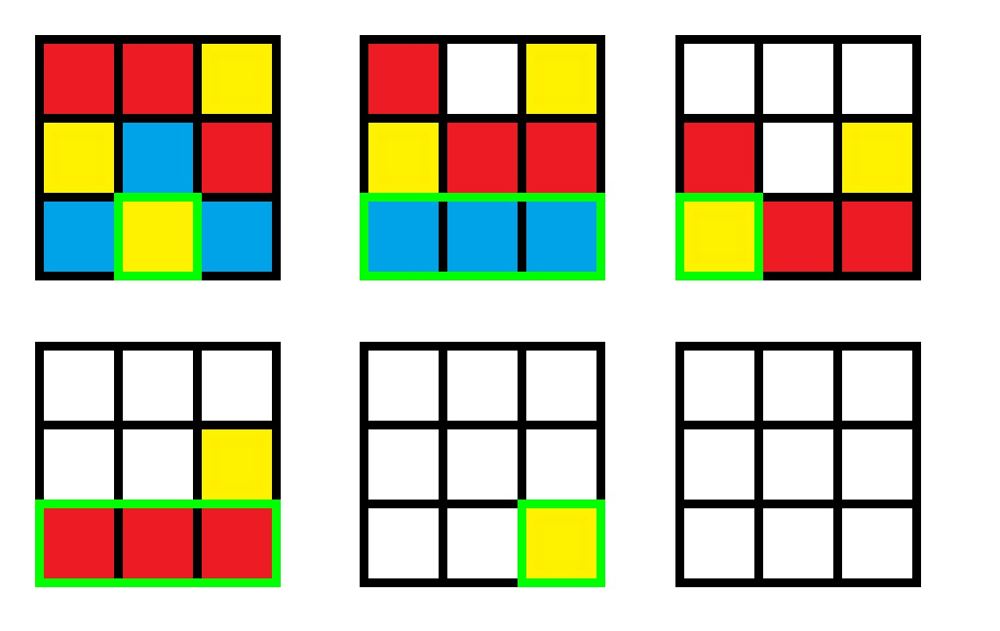

#### 绀珠传说(Tales of Cyanosis Pearls)

时空限制 2000ms / 256MB

凭借着后门的力量，后户密神 Matara Okina 开场不久便 AK 了这场比赛。

而这一切都在 Cirno 的预料之中。

无聊的 Matara Okina 开始玩在比赛开始前便内置在机器中的游戏「绀珠传说 ~ Tales of Cyanosis Pearls」。

游戏规则如下:

> 初始有一个 $n\times n$ 的网格，每个格子内有一颗绀珠。
>
> 绀珠共有 $n$ 种颜色，每种颜色的恰有 $n$ 颗，**均匀随机**地分布在 $n\times n$ 的网格中。
>
> 每次玩家可以在网格的底端一行选取若干个连续相同颜色的绀珠并将其消除。
>
> 消除后，上层绀珠会受重力影响下落。
>
> 玩家重复上述操作直至绀珠全部被消除。游戏结束。

游戏示例:

正当 Matara Okina 放松警惕之时，ExtraTask 悄然弹出。

> 给定游戏绀珠传说的一个**均匀随机**的初始局面，求完成游戏的最小步数。

##### 样例输入

第一行，一个整数 $n$。

以下 $n$ 行，每行 $n$ 个整数，整数的范围为 $[1,n]$。

保证每个整数出现次数恰好为 $n$。保证局面**随机生成**。

$1 \le n \le 1000$。

##### 样例输出

一行，一个整数表示最小步数。

##### 样例

|      | 样例输入                                                     | 样例输出 |
| ---- | ------------------------------------------------------------ | -------- |
| #1   | 3 1 1 2 2 3 1 3 2 3                           | 5        |
| #2   | 5 2 1 4 4 2 2 5 5 1 3 4 1 3 5 1 3 2 5 3 5 1 4 4 2 3 | 15       |
