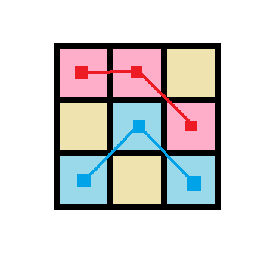

#### 绀珠传说 题解

**Tags** : 最优化 / DP / 树状数组

考虑一种合法的消除方案，在原图中把同一次消除的绀珠用线连起来，示例的消除方案如图。

我们发现

- 一种方案总共的消除次数为 $n^2$ 减去图上连接的线段数量。
- 合法的方案中线段不能交叉。

然后由于线段只处于相邻两列之间，所以线段只可能在相邻列间相交。

所以我们只考虑最大化所有相邻列的线段数量。

由于只有相同颜色的绀珠能连成线段，而线段不能相交，所以问题变成了相邻列的最长公共子序列问题。

直接使用暴力 DP 是 $O(n^3)$ 的。

考虑转化，对对相邻列建立一个 $n\times n$ 的二维网格，如果前一列第 $i$ 个位置与后一列第 $j$ 个位置颜色相同，则平面上 $(i，j)$ 染上颜色，问题转化成了最长导弹拦截问题。

然后可以用树状数组优化二维数点，由于每列期望每种颜色 $O(1)$ 个，所以总时间复杂度 $O(n^2\log n)$。
